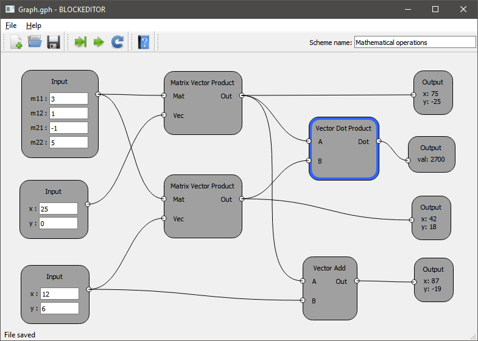

# ICP 2017/2018 Project - BLOCKEDITOR

### Authors: [Tomáš Pazdiora](https://github.com/Aroidzap), [Michal Pospíšil](https://github.com/xpospi95)
		 
FEAUTURES OF THIS IMPLEMENTATION:

### Design patterns usage
- Abstract Factories to generate specific blocks.
- Decorator pattern to bond GUI and core functionality and more.
- Observer to update block values (using callbacks for specific computations) and more.

### Intuitive user interface
- We created an easy-to-use user interface with toolbars. We also support keyboard shortcuts
   and before closing the file, app will ask the user about saving changes 
   if the file was modified.
   
### Merge functionality
- Merging is a feature that opens a file and merges it into the currently opened file.

### File format
- We used own '.gph' file format to avoid confusion with other file formats.
- Saved is only the graph structure without input values.
   
### Help dialog
- We created a help dialog to let the user know how to use the app.

------------------------------------------------

## BUILDING

[Qt](https://www.qt.io/) framework is required for build (tested with Qt 5.6.2).

Easiest way to build is to install [Qt Creator](https://www.qt.io/download) and open `ICP_Project.pro` file.

Makefile:
- `make` builds the application ([Qt](https://www.qt.io/) required)
- `make run` will start the application
- `make doxygen` will generate documentation in 'doc/' folder ([doxygen](http://www.stack.nl/~dimitri/doxygen/) required)
- `make clean` will remove build files

------------------------------------------------

## EXAMPLES
### sin(x) approximation.gph
- Approxiamtion of sin(x) where x is in <0, pi>. First upper value is x and second bottom 
   value is a constant 0.05.